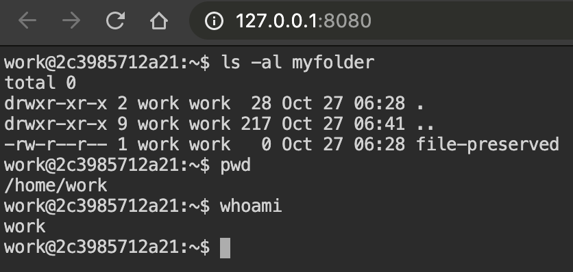
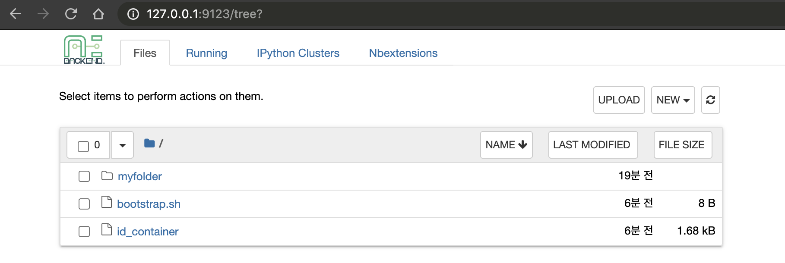
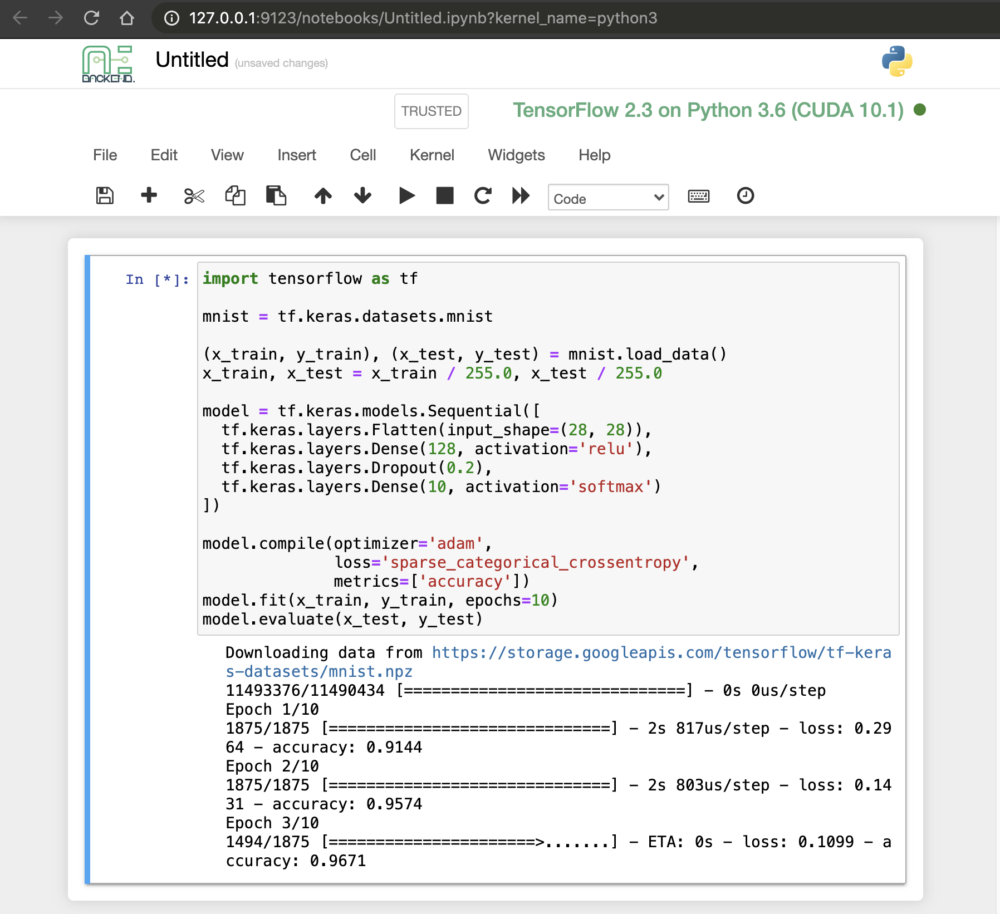

Quickstart
==========

Display Help Text
-----------------

You can print the help text for a command by suffixing ``-h`` or
``--help``.

.. code-block:: shell

   $ backend.ai <cmd> -h
   $ backend.ai <cmd> --help

Login
-----

Login to gain access to the Backend.AI server. ``BACKEND_ENDPOINT_TYPE``
should be set to ``session``, and you need to specify ``BACKEND_ENDPOINT``
correctly.

.. code-block:: shell

   $ export BACKEND_ENDPOINT_TYPE=session
   $ export BACKEND_ENDPOINT=<backend-session-endpoint>
   $ backend.ai login
   User ID: myaccount@example.com
   Password:
   ✔ Login succeeded.

Creating and Using Compute Session
----------------------------------

Backend.AI's compute session provides a dedicated sandbox environment to
run machine learning code and do any other tasks which are available for
Linux.

Query running compute sessions
^^^^^^^^^^^^^^^^^^^^^^^^^^^^^^

.. code-block:: shell

   $ backend.ai ps
   There are no matching sessions.

Execute inline code
^^^^^^^^^^^^^^^^^^^

Specify inline code with ``-c`` option. This will create a new compute
session and execute the code. You can destroy the compute session by ``rm``
command.

.. code-block:: shell

   $ backend.ai run -c "print('hello')" \
         lablup/python-tensorflow:2.3-py36-cuda10.1
   ∙ Session name prefix: pysdk-6dd0b298df
   ✔ [0] Session pysdk-6dd0b298df is ready (domain=default, group=default).
   hello
   ✔ [0] Execution finished. (exit code = 0)
   $ backend.ai ps
   Session Name      Task/Kernel ID                        Image                                                       Type         Status    Status Info    Last updated                      Result
   ----------------  ------------------------------------  ----------------------------------------------------------  -----------  --------  -------------  --------------------------------  ---------
   pysdk-6dd0b298df  106779ac-a997-4456-8612-fc6eca8bd2d5  index.docker.io/lablup/python-tensorflow:2.3-py36-cuda10.1  INTERACTIVE  RUNNING                  2020-10-27T05:05:15.105235+00:00  UNDEFINED
   $ backend.ai rm pysdk-6dd0b298df
   ✔ Done.
   $ backend.ai ps
   There are no matching sessions.

.. note::

   If the code execution failed, you may not belong to the default domain
   and group. You can check your domain and group by:

   .. code-block:: shell

      $ backend.ai admin domain
      $ backend.ai admin groups

   To specify non-default domain and group,

   .. code-block:: shell

      $ backend.ai run -d <domain-name> -g <group-name> \
            -c "print('hello')" lablup/python-tensorflow:2.3-py36-cuda10.1

Execute file
^^^^^^^^^^^^

Specify a local code file (``mycode.py`` below) and a command to execute
on the compute session with ``--exec`` parameter
(``--exec "python mycode.py"``). The local code will be uploaded to the
compute session and be executed by the command given in ``--exec``.

With ``--rm`` option, the compute session will be automatically terminated
after executing the code.

.. code-block:: shell

   $ backend.ai run --rm --exec "python mycode.py" \
         lablup/python-tensorflow:2.3-py36-cuda10.1 mycode.py
   ∙ Session name prefix: pysdk-be065c2666
   ✔ [0] Session pysdk-be065c2666 is ready (domain=default, group=default).
   Uploading files: 100%|██████████████████████████| 25.0/25.0 [00:00<00:00, 157bytes/s, file=mycode.py]
   ✔ [0] Uploading done.
   ✔ [0] Clean finished. (exit code = 0)
   python-kernel: python-kernel: skipping the build phase due to missing "setup.py" file
   ✔ [0] Build finished. (exit code = 0)
   this is my code
   ✔ [0] Execution finished. (exit code = 0)
   ✔ [0] Cleaned up the session.

Run code with specific resources
^^^^^^^^^^^^^^^^^^^^^^^^^^^^^^^^

Backend.AI offers virtualized compute resources per compute session, such
as CPU core(s), main memory, GPU(s), and etc. To specify recources for a
compute session, you can rely on ``-r <resource>=<value>`` option.

Backend.AI offers a fractional GPU sharing (TM), so you can allocate a
fraction of single physical GPU to your compute session.

.. note::

   Fractional GPU sharing is only available on Backend.AI Enterprise
   edition. For open source version, you can only allocate GPUs as a
   physiclal unit.

Let's execute a code to check CPU and memory status inside a compute
session. Save the python code below on your local machine with the file
name ``main.py``

.. code-block:: python

   def cpu_number(a,b):
       return list(range(a, b+1))

   with open("/sys/fs/cgroup/memory/memory.limit_in_bytes") as fd:
       contents = fd.read()
       print("Memory: {} GB\n *  Real value: {}".format(int(contents) /1024/1024/1024, contents))
   with open("/sys/fs/cgroup/cpuset/cpuset.cpus") as fd:
       contents = fd.read()
       cpu_numbers = cpu_number(*[ int(x.strip())  for x in contents.split('-' ) ]) \
       if '-' in contents else [int(contents.strip())]
       print("Number of CPU(s): {}\n *  CPU core number(s)   {}".format(len(cpu_numbers), cpu_numbers))

And run the code to check the resources. Here, we specified 3 cpus, 2g
memory, and 0.5 fraction of GPU unit (``cuda.shares`` option). For open
source version, you must specify GPU resources with ``cuda.device`` option,
like ``cuda.device=2`` to allocate 2 physical GPUs to the compute session.

.. note::

   If the file name is ``main.py``, you do not need to supply ``--exec``
   parameter since ``main.py`` is the default file name.

.. code-block:: shell

   $ backend.ai run -r cpu=3 -r mem=2g -r cuda.shares=0.5 \
         lablup/python-tensorflow:2.3-py36-cuda10.1 main.py
   ∙ Session name prefix: pysdk-59405ab5a0
   ✔ [0] Session pysdk-b53bbf9abb is ready (domain=default, group=default).
   Uploading files: 100%|██████████████████████████| 552/552 [00:00<00:00, 6.90kbytes/s, file=main.py]
   ✔ [0] Uploading done.
   ✔ [0] Clean finished. (exit code = 0)
   python-kernel: python-kernel: skipping the build phase due to missing "setup.py" file
   ✔ [0] Build finished. (exit code = 0)
   Memory: 1.9375 GB
    *  Real value: 2080374784

   Number of CPU(s): 3
    *  CPU core number(s)   [0, 1, 2]
   ✔ [0] Execution finished. (exit code = 0)

You see the result matches the resources specified by ``-r`` option.

Now, check the allocated amount of GPU. This time, by using
``-t <session-name>`` option, we can recycle the already running compute
session, not creating new one. Also, note that we specified ``--exec``
option to execute ``nvidia-smi`` command instead of executing ``main.py``.

.. code-block:: shell

   $ backend.ai ps -f name,occupied_slots,status,image
   Session Name      Occupied Resource                                        Status    Image
   ----------------  -------------------------------------------------------  --------  ----------------------------------------------------------
   pysdk-b53bbf9abb  {"cpu": "3", "mem": "2147483648", "cuda.shares": "0.5"}  RUNNING   index.docker.io/lablup/python-tensorflow:2.3-py36-cuda10.1
   $ backend.ai run -t pysdk-b53bbf9abb --exec "nvidia-smi" \
         lablup/python-tensorflow:2.3-py36-cuda10.1 main.py
   ∙ Session name prefix: pysdk-b53bbf9abb
   ✔ [0] Reusing session pysdk-b53bbf9abb...
   Uploading files: 100%|██████████████████████████| 552/552 [00:00<00:00, 6.95kbytes/s, file=main.py]
   ✔ [0] Uploading done.
   ✔ [0] Clean finished. (exit code = 0)
   python-kernel: python-kernel: skipping the build phase due to missing "setup.py" file
   ✔ [0] Build finished. (exit code = 0)
   Tue Oct 27 05:40:22 2020
   +-----------------------------------------------------------------------------+
   | NVIDIA-SMI 450.51.06    Driver Version: 450.51.06    CUDA Version: 11.0     |
   |-------------------------------+----------------------+----------------------+
   | GPU  Name        Persistence-M| Bus-Id        Disp.A | Volatile Uncorr. ECC |
   | Fan  Temp  Perf  Pwr:Usage/Cap|         Memory-Usage | GPU-Util  Compute M. |
   |                               |                      |               MIG M. |
   |===============================+======================+======================|
   |   0  CUDA GPU            Off  | 00000000:01:00.0 Off |                  N/A |
   |  0%   47C    P8    11W / 151W |     16MiB /  2029MiB |      0%      Default |
   |                               |                      |                  N/A |
   +-------------------------------+----------------------+----------------------+

   +-----------------------------------------------------------------------------+
   | Processes:                                                                  |
   |  GPU   GI   CI        PID   Type   Process name                  GPU Memory |
   |        ID   ID                                                   Usage      |
   |=============================================================================|
   |  No running processes found                                                 |
   +-----------------------------------------------------------------------------+
   ✔ [0] Execution finished. (exit code = 0)

Note that only half of the GPU memory is allocated (~2 GiB), which shows
fractional GPU sharing is working.

.. note::
   The amount of 1 fraction GPU unit (fGPU) may differ depending on the
   server setting. The exact GPU unit configuration should be check by the
   admins, if needed.

If you're done, destroy the compute session.

.. code-block:: shell

   $ backend.ai rm pysdk-b53bbf9abb
   ✔ Done.

Data Storage Folder
-------------------

By default, data (files and folders) created and updated inside a compute
session are volatile, meaning they are lost when the session is terminated.
To keep data after session termination, you can save data to a data storage
folder, which we call virtual folder.

Create a storage folder (virtual folder)
^^^^^^^^^^^^^^^^^^^^^^^^^^^^^^^^^^^^^^^^

Backend.AI supports multiple file systems simultaneously, so to create a
virtual folder, you need to query and choose what host to use beforehand.

To query and create a virtual folder, follow the steps below.

.. code-block:: shell

   $ backend.ai vfolder list
   There is no virtual folders created yet.
   $ backend.ai vfolder list-hosts  # list possible virtual folder hosts
   Default vfolder host: local
   Usable hosts: local              # in this case, "local" is our host
   $ backend.ai vfolder create myfolder local
   Virtual folder "myfolder" is created.
   $ backend.ai vfolder list
   Name      ID                                Owner    Permission    Owership Type    Usage Mode    User                                  Group
   --------  --------------------------------  -------  ------------  ---------------  ------------  ------------------------------------  -------
   myfolder  154523348d844cd1bddbfaa43024a823  True     rw            user             general       dfa9da54-4b28-432f-be29-c0d680c7a412

Using virtual folder
^^^^^^^^^^^^^^^^^^^^

It's time to create a compute session with virtual folder mounted. In the
example below, ``-m`` option is used to mount just created ``myfolder``.
This folder is mounted under ``/home/work/`` inside the compute session.
Let's check this is true by executing ``ls`` command on ``/home/work``
inside the compute session.

.. code-block:: shell

   $ backend.ai run --rm --exec "ls /home/work" \
         lablup/python-tensorflow:2.3-py36-cuda10.1 main.py
   ∙ Session name prefix: pysdk-ffa1b5d3be
   ✔ [0] Session pysdk-ffa1b5d3be is ready (domain=default, group=default).
   Uploading files: 100%|██████████████████████████| 552/552 [00:00<00:00, 6.80kbytes/s, file=main.py]
   ✔ [0] Uploading done.
   ✔ [0] Clean finished. (exit code = 0)
   python-kernel: python-kernel: skipping the build phase due to missing "setup.py" file
   ✔ [0] Build finished. (exit code = 0)
   bootstrap.sh
   id_container
   main.py
   ✔ [0] Execution finished. (exit code = 0)
   ✔ [0] Cleaned up the session.
   $
   $ backend.ai run --rm -m myfolder --exec "ls /home/work" \
         lablup/python-tensorflow:2.3-py36-cuda10.1 main.py
   ∙ Session name prefix: pysdk-7adc7a4cf5
   ✔ [0] Session pysdk-7adc7a4cf5 is ready (domain=default, group=default).
   Uploading files: 100%|██████████████████████████████████████████████████████████████████████████████████████████████████████████████████████████████████████████████████████████████████████████████████████████████████████████████████| 552/552 [00:00<00:00, 6.04kbytes/s, file=main.py]
   ✔ [0] Uploading done.
   ✔ [0] Clean finished. (exit code = 0)
   python-kernel: python-kernel: skipping the build phase due to missing "setup.py" file
   ✔ [0] Build finished. (exit code = 0)
   bootstrap.sh
   id_container
   main.py
   myfolder
   ✔ [0] Execution finished. (exit code = 0)
   ✔ [0] Cleaned up the session.

Note that ``/home/work/myfolder`` only appears when ``-m`` option is used.
If you create a file inside virtual folder (``myfolder`` in this case), it
will be preserved after compute session is terminated (``--rm``). You can
check this by using ``vfolder ls`` command, which displays the
file/directory inside a specific virtual folder.

.. code-block:: shell

   $ backend.ai vfolder ls myfolder
   ✔ Retrived.
   file name    size    modified    mode
   -----------  ------  ----------  ------
   $ backend.ai run --rm -m myfolder --exec "touch /home/work/myfolder/file-preserved" \
         lablup/python-tensorflow:2.3-py36-cuda10.1 main.py
   ∙ Session name prefix: pysdk-95c788a7b2
   ✔ [0] Session pysdk-95c788a7b2 is ready (domain=default, group=default).
   Uploading files: 100%|██████████████████████████████████████████████████████████████████████████████████████████████████████████████████████████████████████████████████████████████████████████████████████████████████████████████████| 552/552 [00:00<00:00, 5.73kbytes/s, file=main.py]
   ✔ [0] Uploading done.
   ✔ [0] Clean finished. (exit code = 0)
   python-kernel: python-kernel: skipping the build phase due to missing "setup.py" file
   ✔ [0] Build finished. (exit code = 0)
   ✔ [0] Execution finished. (exit code = 0)
   ✔ [0] Cleaned up the session.
   $ backend.ai vfolder ls myfolder
   backend.ai vfolder ls myfolder
   ✔ Retrived.
   file name         size  modified              mode
   --------------  ------  --------------------  ----------
   file-preserved       0  Oct 27 2020 15:28:40  -rw-r--r--

.. warning::

   Keep in mind that lf you want to preserve any data generated from the
   compute session, you must mount at least one virtual folder, and save the
   data under it.

Using Interactive Apps
----------------------

Backend.AI CLI provides web-based interactive apps, but for now, this
feature is only available in API (KeyPair) connection mode.

API (KeyPair) Connection Mode
^^^^^^^^^^^^^^^^^^^^^^^^^^^^^

In API connection mode, you don't need to login with your email and
password, but need to provide additional environment variables. The
endpoint for API connection mode and access-/secret-key should be got from
your Backend.AI admins.

.. code-block:: shell

   $ export BACKEND_ENDPOINT_TYPE=api
   $ # This endpoint may differ from the one used for session mode.
   $ export BACKEND_ENDPOINT=<backend-api-endpoint>
   $ export BACKEND_ACCESS_KEY=<access-key>
   $ export BACKEND_SECRET_KEY=<secret-key>

Start a compute session
^^^^^^^^^^^^^^^^^^^^^^^

You can create a compute session without executing any code. Note that
there is no ``--rm`` option in the example below, and we specified session
name with ``-t`` option.

.. code-block:: shell

   $ backend.ai start -t app-test -m myfolder \
         -r cpu=4 -r mem=8g -r cuda.shares=1 \
         lablup/python-tensorflow:2.3-py36-cuda10.1
   ∙ Session ID 70e265d4-52b5-4084-86d0-b6c2625c5e4a is created and ready.
   ∙ This session provides the following app services: jupyter, jupyterlab, vscode, tensorboard, sshd, ttyd

Launch Terminal
^^^^^^^^^^^^^^^

From the last message of the above code block, you can see that the session
reports app services available, such as jupyter, ttyd, etc. These are the
list of interactive apps, mostly provide web-based easy-to-use UI.  Here,
let's launch a web-terminal (``ttyd``) using ``app`` command.

.. code-block:: shell

   $ backend.ai app app-test ttyd
   ∙ A local proxy to the application "ttyd" provided by the session "app-test" is available at:
     http://127.0.0.1:8080

Open your web broswer, and type http://127.0.0.1:8080 in the URL bar. You
are now connected to the compute session through web-based terminal. Every
command you typically use from a terminal will work.

Web terminal deploys tmux by default, so you can use powerful features
provided by tmux, if you want.

If you're done, press ``Ctrl-C`` to cancel the ttyd web service.

Launch Jupyter Notebook
^^^^^^^^^^^^^^^^^^^^^^^

With ``-b`` (bind) option, you can launch the app from any local port.

.. code-block:: shell

   $ backend.ai app -b 9123 app-test jupyter
   ∙ A local proxy to the application "jupyter" provided by the session "app-test" is available at:
     http://127.0.0.1:9123

This time, open http://127.0.0.1:9123 from your browser. You can now use
Jupyter Notebook app. No need to install python.

A ML code can also be executed directly without installing 3rd party
packages.

If you're done, press ``Ctrl-C`` to cancel the Jupyter Notebook service.

SSH into the Compute Session
^^^^^^^^^^^^^^^^^^^^^^^^^^^^

Backend.AI supports OpenSSH-based public key connection (RSA2048). A SSH
private key is placed at ``/home/work/id_container`` for user's
convenience, so you can establish real SSH connection into the compute
session.

.. note::
   To access with a client such as PuTTY on Windows, a private key
   (``id_container``) must be converted into a ``ppk`` file through a
   program such as PuTTYgen. You can refer to the following link for the
   conversion method: https://wiki.filezilla-project.org/Howto.

.. code-block:: shell

   $ # download /home/work/id_container
   $ backend.ai download app-test id_container
   $ mv id_container ~/.ssh/id_container
   $ backend.ai app app-test sshd -b 9922
   ∙ A local proxy to the application "sshd" provided by the session "app-test" is available at:
     http://127.0.0.1:9922

In another terminal on the same PC:

.. code-block:: shell

   $ ssh -o StrictHostKeyChecking=no \
   >     -o UserKnownHostsFile=/dev/null \
   >     -i ~/.ssh/id_container \
   >     work@localhost -p 9922
   Warning: Permanently added '[localhost]:9922' (RSA) to the list of known hosts.
   work@dab597c32a10:~$ ls -al myfolder
   total 0
   drwxr-xr-x 2 work work  28 Oct 27 06:28 .
   drwxr-xr-x 9 work work 217 Oct 27 06:57 ..
   -rw-r--r-- 1 work work   0 Oct 27 06:28 file-preserved
   work@dab597c32a10:~$ pwd
   /home/work
   work@dab597c32a10:~$ whoami
   work
   work@dab597c32a10:~$

You can easily open sFTP connection with the same way.
